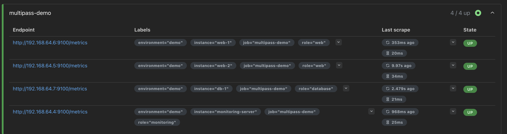
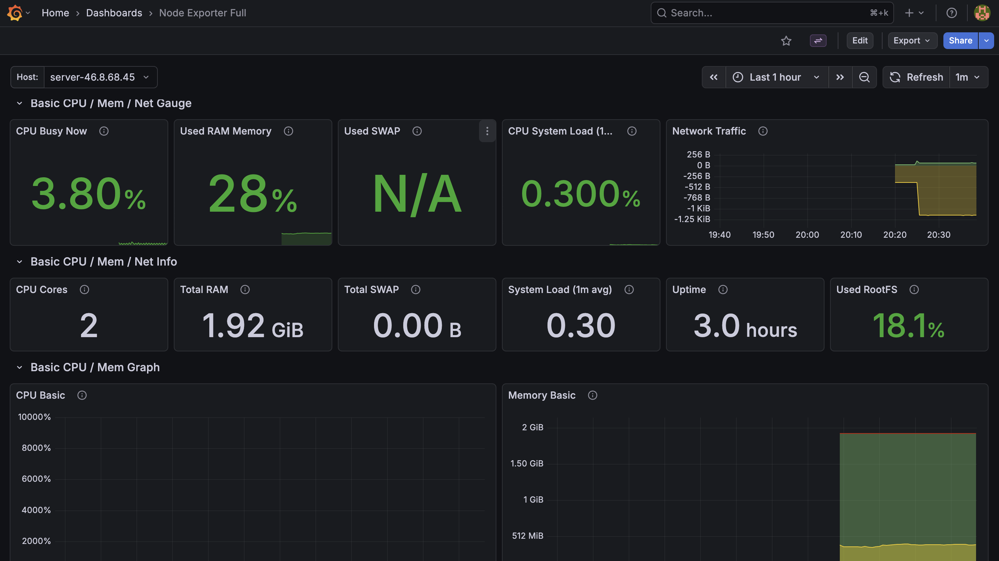
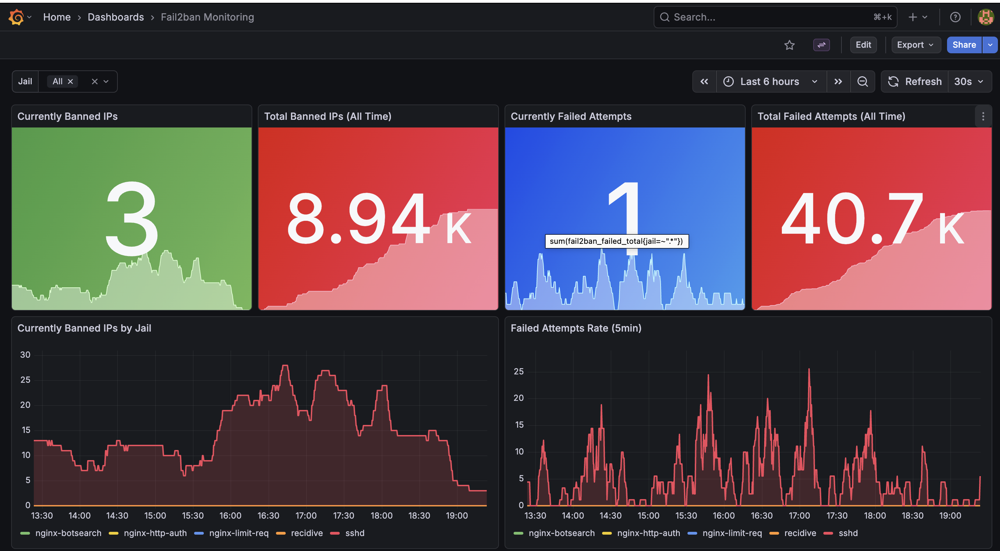
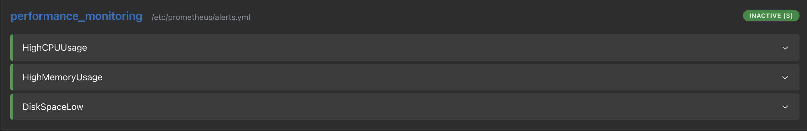
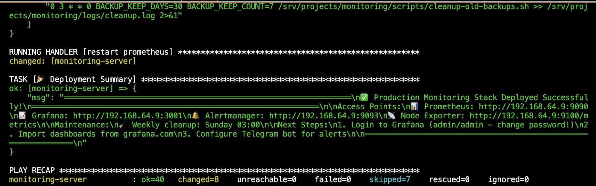

# Enterprise Monitoring Stack

**Production-ready monitoring solution with Prometheus, Grafana, and advanced security features**

[](LICENSE.md)
[](CHANGELOG.md)
[]()

---

## What is this?

A complete, production-ready monitoring stack that you can deploy in minutes, not days. Built with DevOps best practices and battle-tested in production environments.

### Key Highlights

*Below: the full (PRO) offering. FREE version includes basic stack, 2 dashboards, 5 alerts, and manual setup — see comparison table.*

- **One-command deployment** with Ansible (PRO)
- **Multi-server monitoring** out of the box — one command deploys Node Exporter on N servers (PRO)
- **Advanced security monitoring** with fail2ban integration (PRO, UNIQUE!)
- **20 production-ready alerts** (PRO; FREE has 5 basic)
- **8 professional Grafana dashboards** (PRO: system, fail2ban, Prometheus, Blackbox, Nginx, PostgreSQL, RabbitMQ, Redis; FREE has 2 basic)
- **Complete documentation** — 20 guides (PRO); FREE has basic docs

---

## Screenshots

### Multi-Server Monitoring
Monitor multiple servers from a single dashboard with role-based organization.



### Professional Dashboards
8 ready-to-use dashboards (system, fail2ban, Prometheus, Blackbox, Nginx, PostgreSQL, RabbitMQ, Redis).


### System Metrics Visualization
Real-time CPU, Memory, Disk, and Network monitoring with historical data.



### fail2ban Security Monitoring (UNIQUE FEATURE!)
Monitor security threats and blocked IPs in real-time - a feature you won't find in other solutions!



### Production-Ready Alerts & Automation
20 pre-configured alert rules with smart routing (Telegram, email). One-command Ansible deployment.




---

## Quick Start

### FREE Version — Deploy in 2 minutes

```bash
# 1. Clone the repository
git clone https://github.com/Airat71/monitoring-stack.git
cd monitoring-stack/prometheus-grafana

# 2. Set your Grafana password
cp .env.example .env
# Edit .env — change GRAFANA_PASSWORD

# 3. Start the stack
docker compose up -d

# 4. Access dashboards
# Grafana:    http://localhost:3001  (admin / your password)
# Prometheus: http://localhost:9090
```

**What you get:** Prometheus + Grafana + Node Exporter, 2 dashboards (System Overview, Node Exporter Full), 5 alert rules.

### Production Deployment (PRO)

PRO version adds Ansible automation, Alertmanager with Telegram/Email, fail2ban monitoring, 8 dashboards, 20 alerts.
See [QUICK_START.md](docs/QUICK_START.md) for details.

---

## FREE vs PRO

| Feature | FREE | PRO ($40 one-time) |
|---------|------|---------------------|
| **Deployment** | Docker Compose (manual) | ✅ One-command Ansible |
| **Containers** | 3 (Prometheus, Grafana, Node Exporter) | ✅ **6** (+Alertmanager, Blackbox, Telegram Bot) |
| **Dashboards** | 2 basic (System Overview, Node Exporter) | ✅ **8** professional (+fail2ban, Blackbox, Nginx, PostgreSQL, RabbitMQ, Redis) |
| **Alerts** | 5 basic (Prometheus UI only) | ✅ **20** production-ready + Telegram/Email notifications |
| **fail2ban Monitoring** | ❌ | ✅ **Unique security feature!** |
| **Multi-server** | Manual config | ✅ One-command Ansible deployment on N servers |
| **Documentation** | Basic (README, QUICK_START) | ✅ 20 detailed guides |
| **Support** | Community (GitHub Issues) | ✅ Direct email support |

- **FREE:** `docker compose up -d` — working stack with 2 dashboards and 5 alerts. [Try it now](#quick-start).
- **PRO:** Ansible automation, 8 dashboards, 20 alerts, fail2ban, Telegram notifications. [PURCHASE.md](docs/PURCHASE.md).
- *Optional:* **Installation Service** ($150) — we deploy PRO on your servers. [SERVICES.md](docs/SERVICES.md).

Detailed comparison: [FEATURES.md](docs/FEATURES.md). **[👉 Get PRO Version - $40](docs/PURCHASE.md)**

---

## What's Included

### Monitoring Components
- **Prometheus** - Time-series metrics database
- **Grafana** - Beautiful dashboards and visualizations
- **Alertmanager** - Smart alert routing and notifications
- **Node Exporter** - System metrics collection
- **Blackbox Exporter** - Website and service monitoring
- **fail2ban Integration** - Security threat monitoring (PRO)

### Infrastructure
- Docker Compose orchestration (FREE + PRO)
- Automated backups (PRO; FREE: manual)
- Health checks and auto-restart
- Secure localhost-only binding
- SSH tunnel access setup

### Documentation
- **FREE:** README, [QUICK_START](docs/QUICK_START.md), [FEATURES](docs/FEATURES.md).
- **PRO:** 20 guides (deployment, security, operations, fail2ban, backups, troubleshooting, etc.).

---

## System Requirements

**Minimum:**
- Ubuntu 20.04 / 22.04 LTS
- 2GB RAM
- 2 CPU cores
- 20GB disk space
- Docker + Docker Compose

**Recommended (Production):**
- Ubuntu 22.04 LTS
- 4GB RAM
- 4 CPU cores
- 50GB SSD
- Separate monitoring server

---

## Architecture

```
┌─────────────────────────────────────────────────┐
│         Monitoring Server                       │
│  ┌─────────────┐  ┌─────────────┐               │
│  │ Prometheus  │  │   Grafana   │               │
│  │   :9090     │  │    :3001    │               │
│  └──────┬──────┘  └─────────────┘               │
│         │                                        │
│         ├──────────────────────────────┐         │
│         │                              │         │
│  ┌──────▼──────┐            ┌─────────▼──────┐  │
│  │Alertmanager │            │  fail2ban      │  │
│  │   :9093     │            │  Exporter      │  │
│  └─────────────┘            └────────────────┘  │
└─────────────────────────────────────────────────┘
                    │
        ┌───────────┼───────────┐
        │           │           │
   ┌────▼───┐  ┌───▼────┐  ┌──▼─────┐
   │ Web-1  │  │ Web-2  │  │  DB-1  │
   │ :9100  │  │ :9100  │  │ :9100  │
   └────────┘  └────────┘  └────────┘
```

---

## Use Cases

✅ **DevOps Teams** - Monitor infrastructure and get alerted before users notice issues
✅ **SysAdmins** - Centralized monitoring for multiple servers
✅ **Small Businesses** - Professional monitoring without enterprise costs
✅ **Freelancers** - Offer monitoring as a service to clients
✅ **Learning** - Study production-grade monitoring setup

---

## Why This Solution?

### 1. Production-Ready from Day One
Not a toy project - used in production with real workloads.

### 2. Time Savings
Deploy in 10 minutes vs. weeks of manual configuration.

### 3. Best Practices Built-In
- Security-first design (localhost binding, SSH tunnels)
- Automated backups
- Health monitoring
- Alert fatigue prevention
- Documentation-driven

### 4. Unique Features
**fail2ban monitoring integration** - track security threats in real-time. Not available in standard Grafana dashboards!

### 5. Complete Solution
Everything you need: monitoring, alerting, dashboards, backups, documentation.

---

## Documentation

**Free Documentation:**
- [README.md](README.md) - This file
- [QUICK_START.md](docs/QUICK_START.md) - Get started in 5 minutes
- [FEATURES.md](docs/FEATURES.md) - Detailed FREE vs PRO comparison

**PRO Documentation (20 guides — included with purchase):**
- INSTALLATION.md - Production deployment with Ansible
- SECURITY.md - Security best practices (localhost binding, SSH tunnels, hardening)
- OPERATIONS.md - Daily operations runbook
- MONITORING.md - Alert configuration guide
- TROUBLESHOOTING.md - Advanced troubleshooting
- And 15+ more specialized guides

**[Get PRO Documentation →](docs/PURCHASE.md)**

---

## Support

**FREE Version:**
- Community support via GitHub Issues
- Basic documentation

**PRO Version ($40):**
- ✅ Direct email support
- ✅ Priority bug fixes
- ✅ Custom configuration help
- ✅ 20 detailed documentation guides

---

## Pricing

### FREE Version
**$0** - Perfect for learning and small projects
- Manual setup
- 2 basic dashboards
- Community support

### PRO Version
**$40** - One-time payment, lifetime access
- ✅ One-command deployment
- ✅ 8 professional dashboards
- ✅ fail2ban security monitoring
- ✅ 20 production alerts
- ✅ Complete documentation (20 guides)
- ✅ Email support

**[Get PRO Version →](docs/PURCHASE.md)**

### Installation Service
**$150** - Full installation and setup
- Professional deployment on your servers
- Custom alert configuration
- Knowledge transfer session
- 30-day support included

**[Request Installation →](docs/SERVICES.md)**

---

## Changelog

See [CHANGELOG.md](CHANGELOG.md) for version history.

**Latest: v1.0.2** (2026-01-18)
- Enhanced fail2ban monitoring (5 jails)
- Prometheus metrics integration
- Grafana dashboard automation
- Production-ready release

---

## License

This project uses the **Open Core** model:

- **FREE Version**: MIT License - use freely for any purpose
- **PRO Version**: Commercial License - includes additional features and support

See [LICENSE.md](LICENSE.md) for details.

---

## Contributing

Contributions to the FREE version are welcome! See [CONTRIBUTING.md](CONTRIBUTING.md).

For PRO features, please contact us directly.

---

## Author

**DevOps Engineer specializing in monitoring and infrastructure automation**

- GitHub: [Airat71](https://github.com/Airat71)
- Email: airat71@proton.me
- Telegram: [@Airat71](https://t.me/Airat71)

---

---

## FAQ

**Q: Can I use this in production?**
A: Yes! It's designed for production use with security and reliability in mind.

**Q: Do I need Docker experience?**
A: Basic Docker knowledge helps, but detailed instructions are provided.

**Q: Can I monitor Windows servers?**
A: Currently optimized for Linux. Windows support can be added with custom exporters.

**Q: What about cloud providers (AWS, Azure, GCP)?**
A: Works on any cloud provider with standard Linux VMs.

**Q: Is the PRO version a subscription?**
A: No! One-time payment, lifetime access to all current and future updates.

---

**Made with ❤️ for the DevOps community**

⭐ Star this repo if it helped you!
