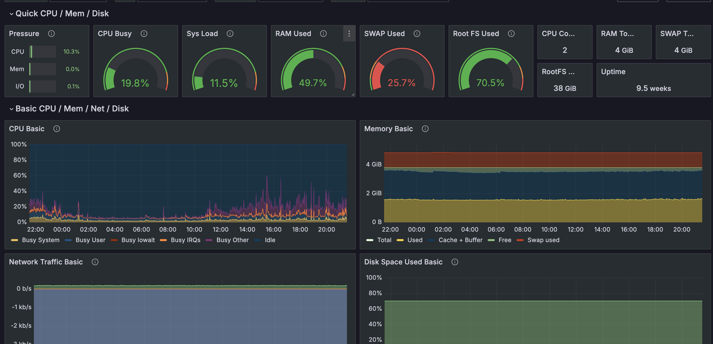

# Monitoring Stack

[](https://github.com/Airat71/monitoring-stack/actions/workflows/ci.yml)
[](https://github.com/Airat71/monitoring-stack/actions/workflows/security.yml)
[](LICENSE.md)
[](https://github.com/Airat71/monitoring-stack/stargazers)

Self-hosted monitoring for Linux servers — Prometheus · Grafana · Alertmanager · Ansible · fail2ban.

One-command deploy, 8 pre-built dashboards, optional Telegram alerts, multi-server support. Ready in 15 minutes.



---

## What's included

| Component | Details |
|-----------|---------|
| **Core stack** | Prometheus · Grafana · Alertmanager · Node Exporter · Blackbox Exporter |
| **Security** | fail2ban integration — ban events visible in Grafana |
| **Ansible automation** | One-command full deployment + Node Exporter on remote hosts |
| **Dashboards** | 8 pre-built JSON dashboards (see below) |
| **Alerts** | 16 alert rules (see docs/MONITORING.md) |
| **Multi-server** | Monitor N servers from one Grafana instance |
| **Backups** | Automated backup script with optional cron |
| **Documentation** | 20 guides: deployment, security, operations, runbook, troubleshooting |

---

## Dashboards

Pre-built Grafana dashboards for immediate visibility:

| Dashboard | What it covers | Source |
|-----------|----------------|--------|
| Node Exporter Full | CPU, memory, disk, network per host | [grafana.com/dashboards/1860](https://grafana.com/grafana/dashboards/1860) |
| Prometheus Overview | Prometheus self-monitoring | community |
| Blackbox Exporter | HTTP/TCP endpoint uptime and latency | [grafana.com/dashboards/7587](https://grafana.com/grafana/dashboards/7587) |
| Nginx | Request rate, error rate, upstreams | [grafana.com/dashboards/12708](https://grafana.com/grafana/dashboards/12708) |
| PostgreSQL | Connections, locks, query performance | [grafana.com/dashboards/9628](https://grafana.com/grafana/dashboards/9628) |
| Redis | Memory, ops/sec, key eviction | [grafana.com/dashboards/11835](https://grafana.com/grafana/dashboards/11835) |
| RabbitMQ | Queue depth, message rate, node health | [grafana.com/dashboards/10991](https://grafana.com/grafana/dashboards/10991) |
| System Overview | CPU, memory, and disk summary for this host | this repository |

---

## Quick Start (Docker Compose — 5 minutes)

```bash
git clone https://github.com/Airat71/monitoring-stack.git
cd monitoring-stack/prometheus-grafana
cp .env.example .env          # set GRAFANA_PASSWORD (required)
docker compose up -d
# Grafana → http://localhost:3001  (admin / your password)
# Prometheus → http://localhost:9090
# Alertmanager → http://localhost:9093
```

---

## Full Deploy with Ansible (single command)

Deploys the complete stack to your server and optionally installs Node Exporter on any number of additional hosts:

```bash
cp ansible/group_vars/all.yml.example ansible/group_vars/all.yml
cp ansible/inventory.example.yml ansible/inventory.yml
# edit both files — set your server IP, SSH user, Telegram token
cd ansible && ansible-playbook -i inventory.yml playbook.yml
```

Step-by-step: [INSTALLATION_GUIDE.md](INSTALLATION_GUIDE.md)

---

## Architecture

```
  [Monitored hosts]
    Node Exporter  ──┐
    fail2ban        ──┤
                     │
              [Prometheus] ──→ [Alertmanager] ──→ Telegram / Email
                     │
              [Blackbox]   (HTTP/TCP probes)
                     │
               [Grafana]   (Dashboards + Alerts UI)
```

---

## Alerts

16 alert rules covering:

- Host down / unreachable
- CPU · memory · disk thresholds
- Service unavailable (HTTP, TCP probes)
- fail2ban ban events
- Prometheus self-monitoring

See [`alerts/alertmanager.example.yml`](alerts/alertmanager.example.yml) for routing configuration.

---

## Documentation

| Guide | Topic |
|-------|-------|
| [INSTALLATION_GUIDE.md](INSTALLATION_GUIDE.md) | Getting started, prerequisites |
| [docs/DEPLOYMENT.md](docs/DEPLOYMENT.md) | Deployment options |
| [docs/MULTI_SERVER.md](docs/MULTI_SERVER.md) | Monitor multiple servers |
| [docs/ALERTMANAGER.md](docs/ALERTMANAGER.md) | Alert routing and receivers |
| [docs/GRAFANA_DASHBOARDS.md](docs/GRAFANA_DASHBOARDS.md) | Dashboard import and usage |
| [docs/SECURITY.md](docs/SECURITY.md) | Security hardening |
| [docs/PRODUCTION_CHECKLIST.md](docs/PRODUCTION_CHECKLIST.md) | Pre-production checklist |
| [docs/BACKUP.md](docs/BACKUP.md) | Backup and restore |
| [docs/TROUBLESHOOTING.md](docs/TROUBLESHOOTING.md) | Common issues and fixes |
| [docs/RUNBOOK.md](docs/RUNBOOK.md) | Operations runbook |
| [docs/UPGRADE.md](docs/UPGRADE.md) | Upgrade guide |

Full index: [docs/INDEX.md](docs/INDEX.md)

---

## Requirements

| Target | What you need |
|--------|---------------|
| Monitoring server | Docker · Docker Compose · SSH access |
| Monitored hosts | Docker (containerized Node Exporter) or systemd (binary) |
| Ansible control node | Ansible 2.9+ · Python 3 · SSH key access to all hosts |

---

## Repository structure

```
monitoring-stack/
├── prometheus-grafana/     # Docker Compose stack (Prometheus, Grafana, Alertmanager, Blackbox)
├── ansible/                # Playbook + roles for full automated deployment
├── grafana-dashboards/     # Pre-built dashboard JSON files
├── alerts/                 # Alertmanager routing config example
├── scripts/                # Backup and dashboard fetch scripts
├── fail2ban/               # fail2ban integration guide
├── docs/                   # 20 guides
└── INSTALLATION_GUIDE.md   # Getting started
```

---

## Contributing

PRs and issues are welcome — see [CONTRIBUTING.md](CONTRIBUTING.md).

---

## License

[MIT](LICENSE.md) — free for personal and commercial use.

---

## Author

Built and maintained by [Airat](https://t.me/Airat71).
